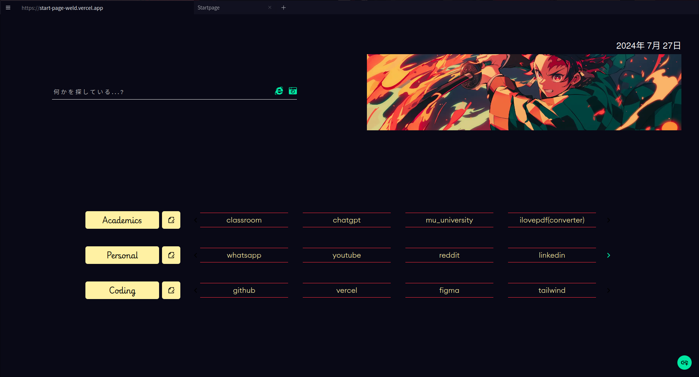

<h1 align="left">Start-page</h1>
<h2 align="left">About 💡</h2>

Custom Startpage for Browsers

  

<h2 align="left">Setup 🛠️</h2>
<h3 align="left">1. Setting it as Homepage</h3>

    1.Fork this repo.
    2.You can use any hosting platform to serve the repo.
    3.Set it as your Home Page:  
      Go to your browser's settings and change the default home page to the
      link where you served the repo.

<h3 align="middle">OR</h3>

    1.Enable the GitHub Pages service.
    2.Then set it up as the default home page as mentioned above.

<h3 align="left">2. Setting it as New Tab</h3>

  -  For Firefox: enable "Force links to open in the top frame (experimental)" in the extension's preferences page.

  -  For Chromium-based Browsers: use the following extension.

<h2 align="left">Usage 🚀</h2>
<h3 align="left">1. Adding a new Workspace</h3>

   - This is a bit complicated, but you can modify the app, useCardsData hook, and the cardHandlers.js components.
   - A maximum of 4 and a minimum of 2 workspaces are required for a fluent response.

<h3 align="left">2. Adding a new Shortcut</h3>

   - Press the link button in the bottom right corner, and a popup will appear.
   - Enter the details in the popup.
  - Click save, and the shortcut will be added.